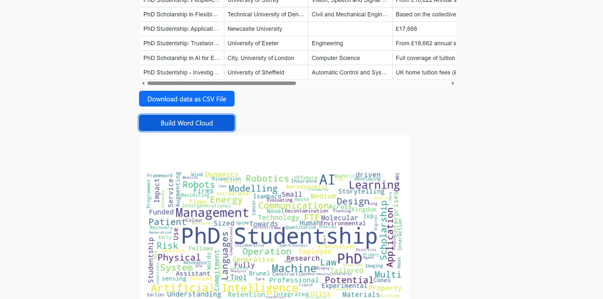

# Emerging-STEM/Careerfinder

live version: https://dgendoolab-careerfinder.onrender.com

One web app that allows you to search and explore PhD and Jobs listings based on servaral criteria, and provides analysis and visualization function based on your search result.

## Usage

1. Access to live version or Run the app and open your web browser and go to `http://localhost:8050` to access the app.

2. Use the dropdowns and input fields to specify your search parameters.

3. Click on the "Find PhDs" or "Find Jobs" button to retrieve and display the PhD/Job listings.

4. Explore the results in the interactive table. You can sort columns, filter data using the range slider, and download the full dataset as a CSV file.

5. Click on the "Build Word Cloud" button to generate a word cloud based on your 'results' data.

## Screenshots

(Layout updating is in progress, screenshots maybe out of date)

- Web Interface
  

  

  

- Result Output

  

- Word Cloud Output

  

## Built With

- [Python](https://docs.python.org/3/) - Programming language used for the backend development.
- [Dash](https://dash.plotly.com/) - Python framework for building analytical web applications.
- [Dash Bootstrap Components](http://dash-bootstrap-components.opensource.faculty.ai/docs/) - Library for creating responsive and visually appealing Dash layouts.
- [BeautifulSoup](https://beautiful-soup-4.readthedocs.io/en/latest/) - Python library for web scraping and parsing HTML data.
- [Pandas](https://pandas.pydata.org/docs/) - Data manipulation library used for processing and analyzing scraped data.
- [Gunicorn](https://gunicorn.org/#docs) - Python WSGI HTTP server for deploying the web app.
- [Render](https://render.com/) - Cloud platform used for deploying and hosting the web app.
- HTML/CSS - Markup and styling languages used for creating the user interface.

## Disclaimer

This project is solely for demonstration purposes, and not intended for commercial use.
